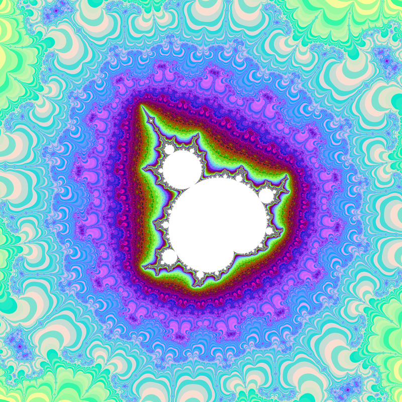

# alpha blending

В ходе работы раассматривалась программа, накладывающая одну картинку на другую с использованием альфа блендинга.

Снова сравнивались две версии программы:\
в первой версии расчёты производились отдельно для каждой точки,\
во второй версии применяются AVX инструкции.

___________________________________________________________

Все тесты проводилиись на процессоре Intel® Core™ i5-1135G7\
с компилятором gcc версии 11.3.0\
Флаги компиляции: -O1 -mavx2

## Результат работы программы ##

Исходные изображения:

Результат наложения:

## Тесты ##

В таблице представлены значения FPS для разных версий и разного количества повторений
 
Версия   | 100 повторений | 1000 повторений | 10000 повторений |
---------|----------------|-----------------|------------------|
 v1      | 40             | 6.2             | 0.65             |
 v2      | 270            | 46              | 5.11             |
 
Пусть k - коэффициент ускорения.

Тогда\
для 100 повторений k = 6.75\
для 1000 повторений k = 7.42\
для 10000 повторений k = 7.86